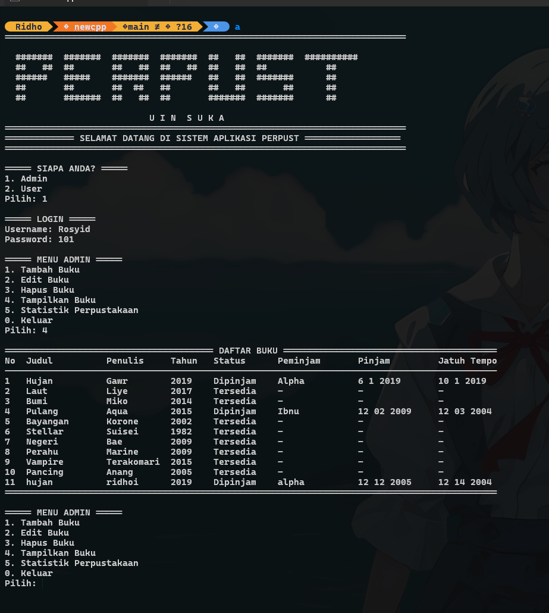

<h1 align="center">📚 PERPUST</h1>

<p align="center">
  <i>Sistem Perpustakaan berbasis C++ dengan penyimpanan file menggunakan library <b>fstream</b></i>
</p>

<p align="center">
  <!-- Badges -->
  
  
  <!--  -->
  
</p>

---

## 🖼️ Preview


---

## 🧾 Deskripsi
**PERPUST** adalah aplikasi manajemen perpustakaan sederhana yang dibangun menggunakan **C++**.  
Seluruh data disimpan dalam **file**, sehingga tetap aman walaupun aplikasi ditutup.  
Cocok digunakan untuk belajar dasar-dasar C++

---

## 🚀 Fitur Utama

### 🔐 **1. Login Admin**
- Username: **Rosyid**
- Password: **101**
- Akses penuh ke semua fitur.

---

### 👥 **2. Login Multi User**
- Mendukung banyak akun user.
- Data user tersimpan pada `user.txt`

---

### 📝 **3. Register User Baru**
- User dapat membuat akun sendiri.
- Data tersimpan otomatis ke file `user.txt`

---

### ➕ **4. Tambah Data Buku**
- Tambah buku baru dengan informasi lengkap.
- Data disimpan di dalam file `databuku.txt`.

---

### ✏️ **5. Edit Data Buku**
- Ubah data seperti judul, penulis, tahun terbit.

---

### 🗑️ **6. Hapus Buku**
- Menghapus buku dari database secara permanen.

---

### 📖 **7. Tampilkan Semua Buku**
- Menampilkan daftar buku dalam tabel yang rapi.
- Tampilan menggunakan library iomanip.

---

### 📚 **8. Pinjam Buku**
- Mencatat:
  - Nama peminjam
  - Judul buku
  - Tanggal pinjam
  - Tanggal kembali

---

### 🔄 **9. Kembalikan Buku**
- Memperbarui status buku menjadi tersedia kembali.

---

### 📊 **10. Statistik Perpustakaan**
Menampilkan:
- Total buku  
- Buku dipinjam  
- Buku tersedia  
- Total user  

---


## 🛠️ Cara Menjalankan

### **1. Clone repository**


```md
git clone https://github.com/somebodymeee/SistemPerpustakaan.git
```

### **2. Masuk ke dalam file folder**
```md
cd SistemPerpustakaan
```

### **3. Compile program**
```md
cd SistemPerpustakaan -o namafilecustom
```

### **4. Jalankan program**
```md
namafilecustom
```